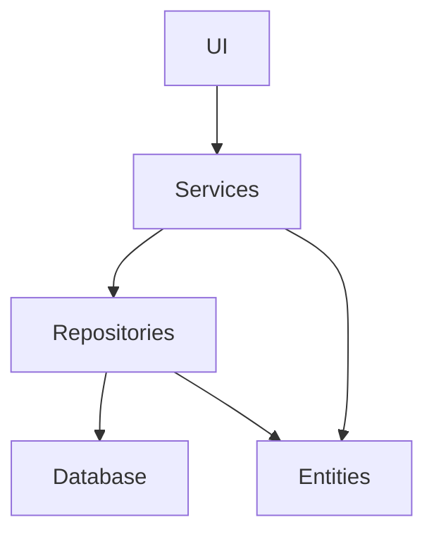
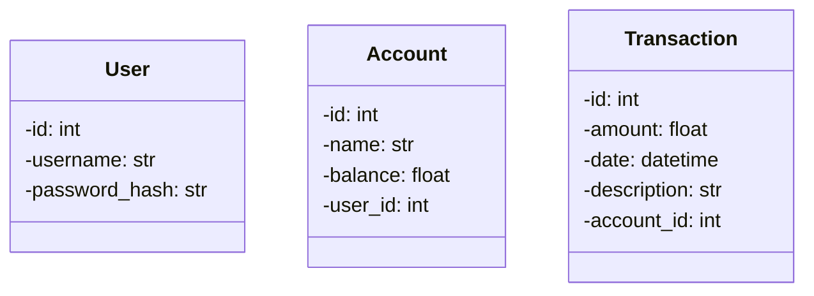

# Pakkauskaavio

## Sovelluslogiikka

Sovelluksen loogisen tietomallin muodostavat luokat [User](../src/entities/user.py), [Account](../src/entities/account.py) ja [Transaction](../src/entities/transaction.py).

