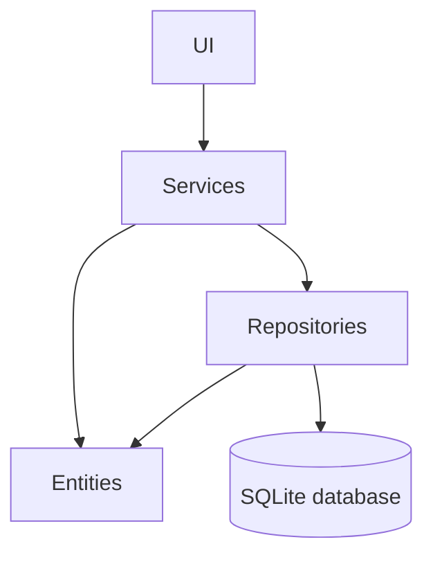
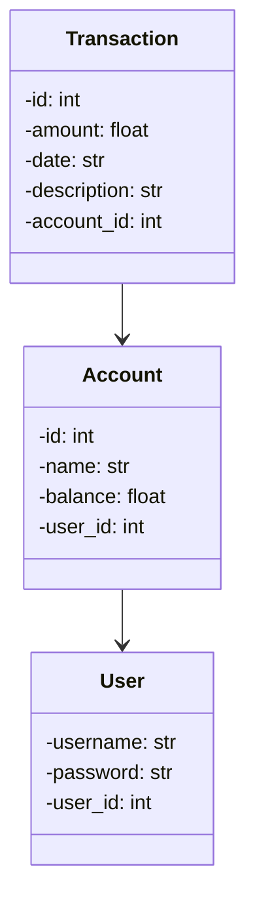

# Arkkitehtuuri

## Pakkauskaavio

Sovelluksen käyttöliittymäkerros sijaitsee `src/ui`-paketissa, sovelluslogiikka `src/services`-paketissa, tietojen tallennuksesta vastaavat luokat `src/repositories`-paketissa ja tietomallin oliot `src/entities`-paketissa.

## Sovelluslogiikka

Sovelluksen loogisen tietomallin muodostavat luokat `User`, `Account` ja `Transaction`.

`User` kuvaa käyttäjää, `Account` käyttäjän tiliä ja `Transaction` tilille kohdistuvaa tapahtumaa. Tili yhdistetään id:n perusteella käyttäjään ja tilitapahtuma taas yhdistetään id:n kautta tiliin.

Sovelluksen toiminnallisuuksista vastaavat service-luokat `UserService`, `AccountService` ja `TransactionService`. `UserService` vastaa käyttäjien luonnista ja kirjautumistarkistuksesta, `AccountService` vastaa tilien luomisesta, nimeämisestä, hakemisesta ja poistamisesta ja `TransactionService` vastaa tilitapahtumien luonnista, muokkaamisesta, hakemisesta ja poistamisesta sekä tilin saldon päivittämisestä tapahtumien muuttuessa.
Tämän lisäksi sovelluksessa on repository-luokat, jotka huolehtivat tietokantayhteyksistä ja tietojen tallentamisesta ja hakemisesta. `UserRepository` huolehtii käyttäjätiedoista, `AccountRepository` tilitiedoista ja `TransactionRepository` tilitapahtumatiedoista.

## Tietojen pysyväistallennus

Sovelluksen juuressa tulee olla `.env`-tiedosto, joka määrittelee käytettävän tietokantatiedoston nimen. `src/db.py` alustaa tietokannan, ja suorittaa SQL-kyselyt.

SQLite-tietokannassa on kolme taulua:

- `users`: käyttäjätunnus ja salasana werkzeug-kirjastolla salattuna
- `accounts`: tilin nimi, saldo ja tilin luoneen käyttäjän id
- `transactions`: tilitapahtuman summa (positiivinen tai negatiivinen), päivämäärä, kuvaus sekä tilin, jolle tapahtuma on luotu, id..
