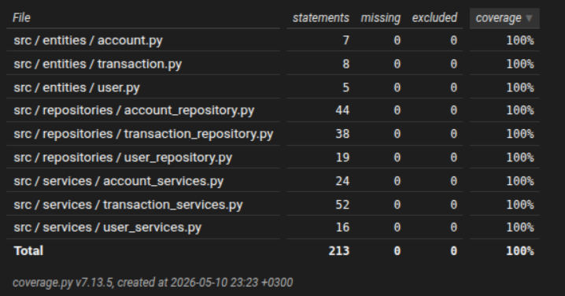

# Testausdokumentti
Ohjelmaa on testattu manuaalisesti sekä automatisoiduin yksikkö- ja integraatiotestein Unittest-kirjastolla. Testit sijaitsevat `tests`-hakemistossa.

## Testikattavuus
Käyttöliittymäkerroksen testien haaraumakattavuus on seuraavia polkuja lukuunottamatta 100%: _src/**/__init__.py, src/tests/**, src/ui/**, src/index.py, src/build.py, src/db.py, src/config.py_.

