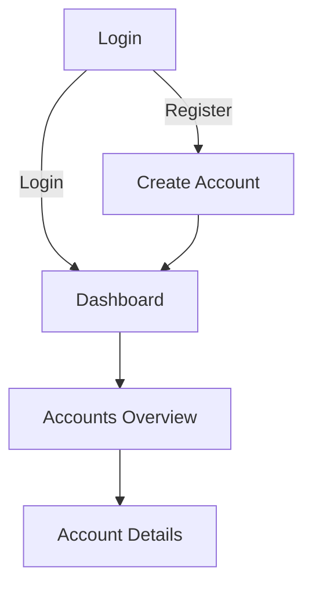
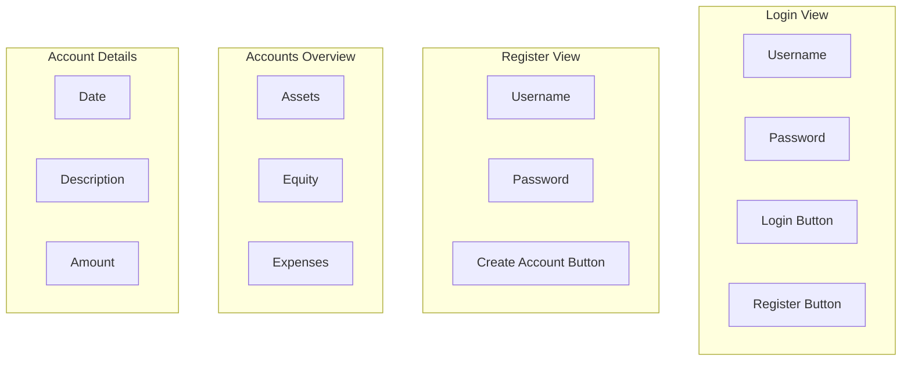

# Vaatimusmäärittely
## Sovelluksen tarkoitus
Sovelluksen avulla käyttäjän on mahdollista toteuttaa kaksinkertainen kirjanpito, jossa jokaisen tapahtuman yhteydessä merkitään sekä mistä raha on tullut että minne se on päätynyt.

## Käyttäjät
Sovelluksella on alkuvaiheessa yksi käyttäjärooli eli _normaali käyttäjä_, muiden käyttäjäroolien tarpeellisuutta punnitaan myöhemmässä vaiheessa.

## Käyttöliittymäluonnos
Sovellus koostuu neljästä eri näkymästä, jotka ovat kirjautumisnäkymä, rekisteröitymisnäkymä, tilit listaava näkymä sekä tilin tapahtumat näyttävä ja uusien tapahtumien lisäämisen mahdollistava näkymä.

