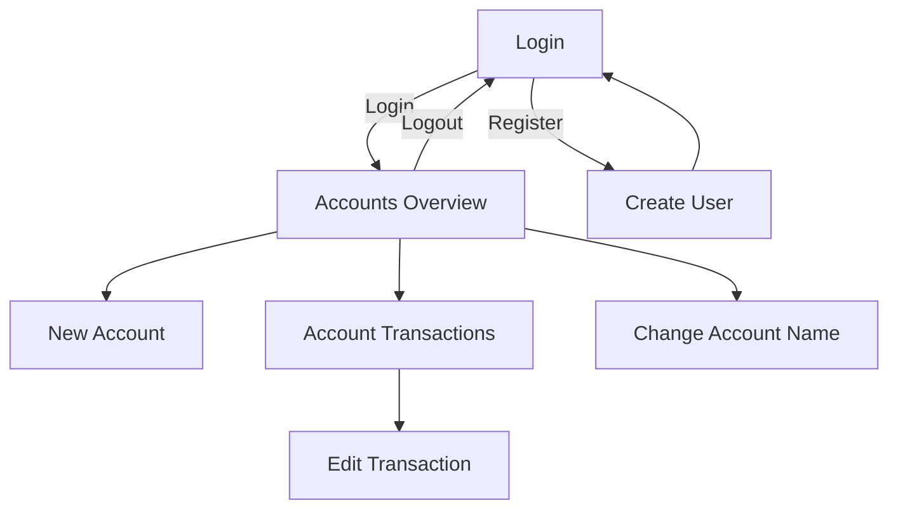
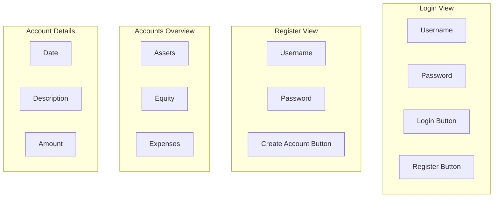

# Vaatimusmäärittely
## Sovelluksen tarkoitus
Sovelluksen avulla käyttäjän on mahdollista toteuttaa kahdenkertaista kirjanpito, jossa jokaisen tapahtuman yhteydessä merkitään sekä mistä raha on tullut että minne se on päätynyt.

## Käyttäjät
Sovelluksella on yksi käyttäjärooli eli _normaali käyttäjä_, käyttäjiä voi olla useita.

## Käyttöliittymä
Sovellus koostuu viidestä eri näkymästä, jotka ovat:
* kirjautumisnäkymä
* rekisteröitymisnäkymä
* tilit listaava sekä yhteisbalanssin laskeva näkymä
* uuden tilin lisäämisen mahdollistava näkymä 
* tilin nimen vaihtamisen mahdollistava näkymä
* tilin transaktiot näyttävä näkymä, josta käsin voidaan myös lisätä, poistaa ja muokata tapahtumia.

```mermaid
flowchart TD
A[Login] -->|Login| D[Accounts Overview]
A -->|Register| B[Create User]
B--> A
D --> E[New Account]
D --> G[Account Transactions]
D --> H[Change Account Name]
G --> I[Edit Transaction]
D -->|Logout|A
```

```mermaid
flowchart TD

subgraph Login_View [Login View]
    A1[Username]
    A2[Password]
    A3[Login Button]
    A4[Register Button]
end

subgraph Register_View [Register View]
    B1[Username]
    B2[Password]
    B3[Create Account Button]
end

subgraph Dashboard_View [Accounts Overview]
    D1[Assets]
    D2[Equity]
    D3[Expenses]
end

subgraph Account_Details_View [Account Details]
    E1[Date]
    E2[Description]
    E3[Amount]
end
```
## Toiminnallisuus
* Käyttäjä voi luoda sovellukseen käyttäjätunnuksen ja asettaa sille salasanan.
    * Jos käyttäjätunnus on jo käytössä, järjestelmä ilmoittaa asiasta.
* Käyttäjä voi kirjautua sovellukseen.
    * Jos salasana tai käyttäjätunnus on väärä, järjestelmä ilmoittaa asiasta.
* Käyttäjä voi luoda, muokata poistaa ja tarkastella tilejä.
    * Tilit voivat olla käyttäjän hallinnoimia tai ulkoisia tilejä, kuten vuokranantajan tai työnantajan. 
* Käyttäjä voi luoda, muokata, poistaa ja tarkastella tilitapahtumia.
* Käyttäjä voi kirjautua ulos järjestelmästä.
