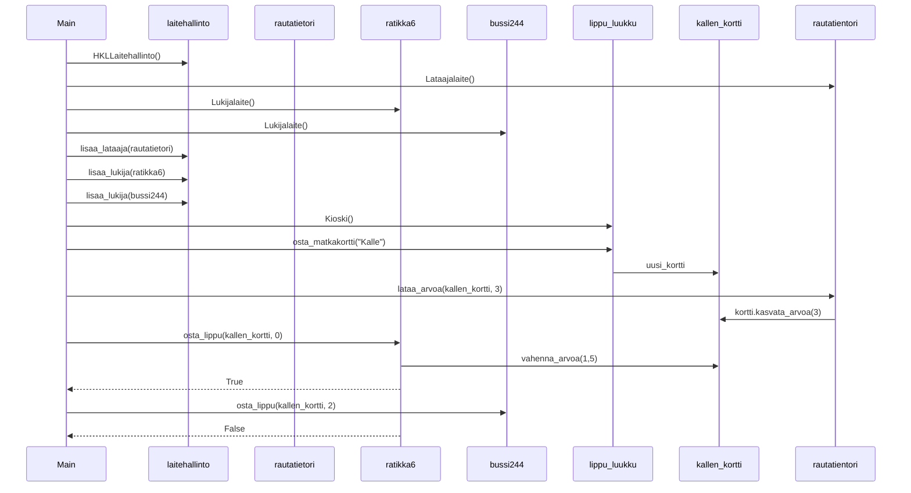

```mermaid
sequenceDiagram
  participant Main
  participant laitehallinto
  participant rautatietori
  participant ratikka6
  participant bussi244
  participant lippu_luukku
  participant kallen_kortti

  Main->>laitehallinto: HKLLaitehallinto()
  Main->>rautatientori: Lataajalaite()
  Main->>ratikka6: Lukijalaite()
  Main->>bussi244: Lukijalaite()
  Main->>laitehallinto: lisaa_lataaja(rautatietori)
  Main->>laitehallinto: lisaa_lukija(ratikka6)
  Main->>laitehallinto: lisaa_lukija(bussi244)
  Main->>lippu_luukku: Kioski()
  Main->>lippu_luukku: osta_matkakortti("Kalle")
  lippu_luukku->>kallen_kortti: uusi_kortti
  Main->>rautatientori: lataa_arvoa(kallen_kortti, 3)
  rautatientori->>kallen_kortti: kortti.kasvata_arvoa(3)
  Main->>ratikka6: osta_lippu(kallen_kortti, 0)
  ratikka6->>kallen_kortti: vahenna_arvoa(1,5)
  ratikka6-->>Main: True
  Main->>bussi244: osta_lippu(kallen_kortti, 2)
  ratikka6-->>Main: False
```
